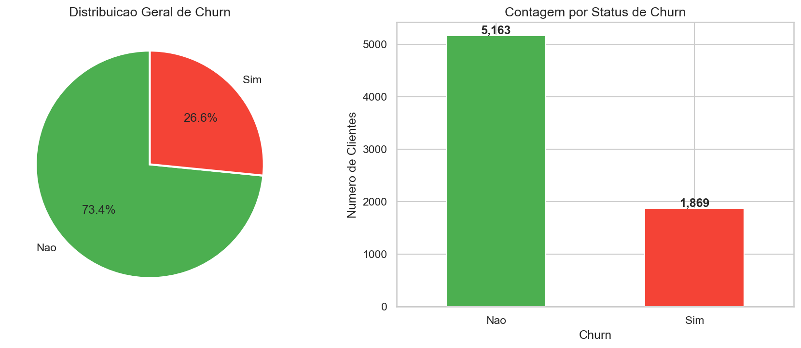
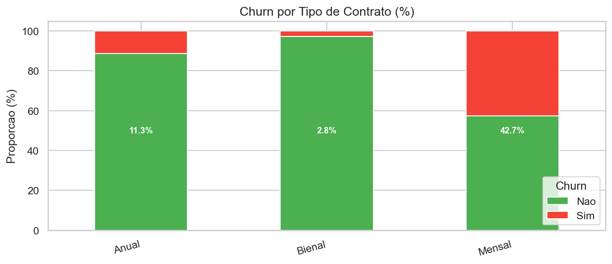
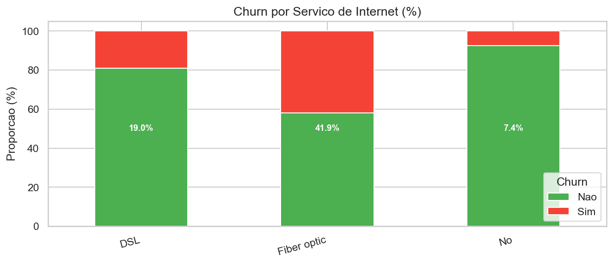
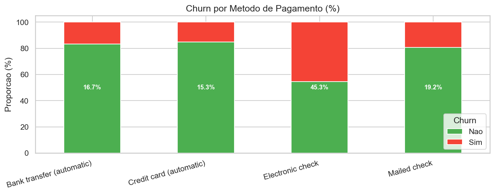
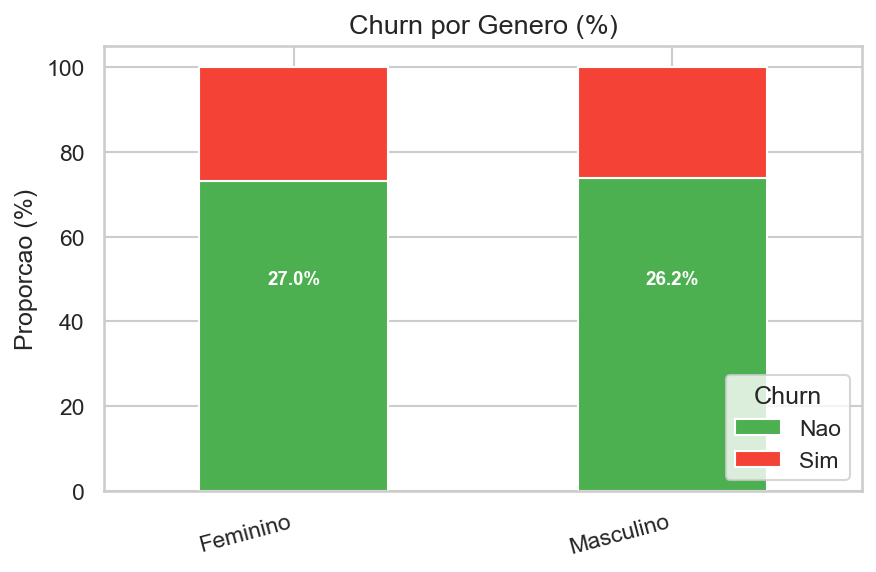
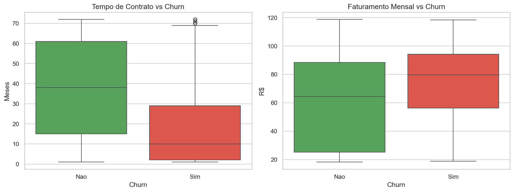
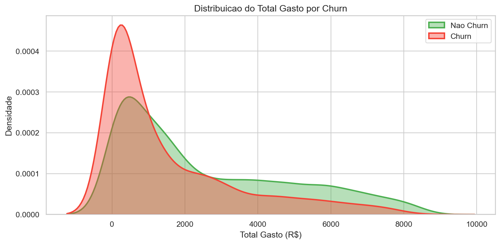
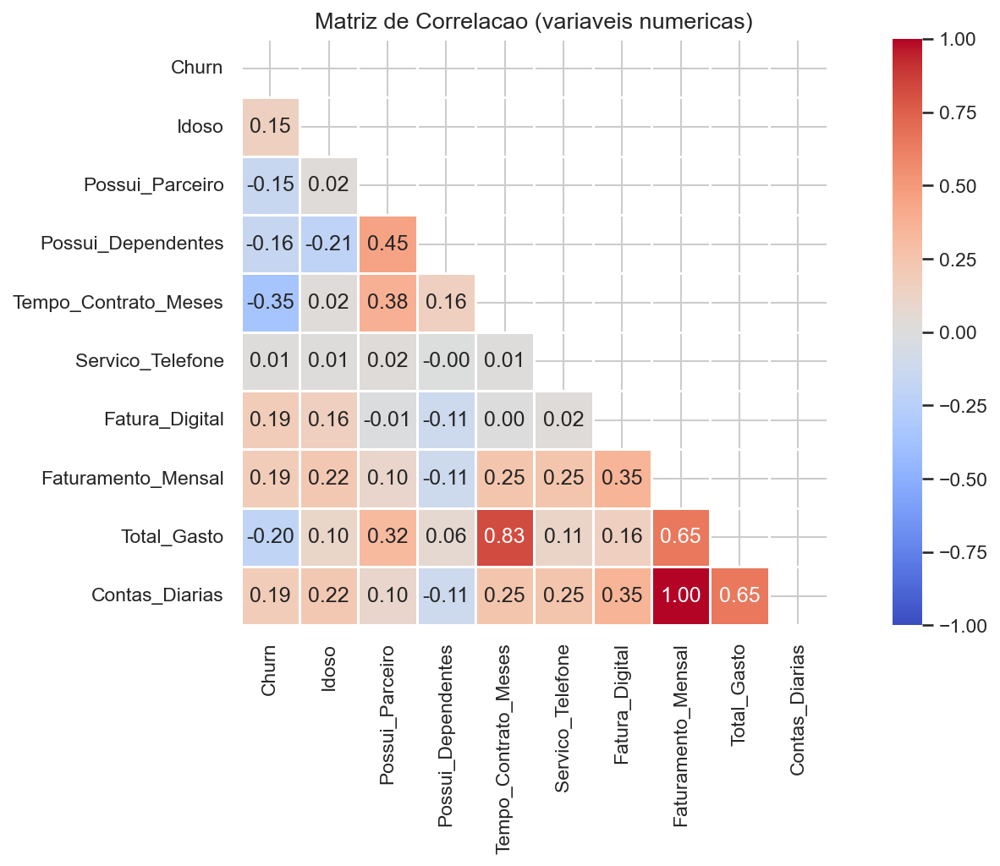

# Relatório Analítico — Churn de Clientes (Telecom X)

## 1. Objetivo do Estudo
Este relatório apresenta uma análise exploratória de dados (EDA) com foco em **identificar padrões associados ao churn de clientes** em uma empresa de telecomunicações.  
O objetivo é compreender **quais características aumentam a probabilidade de cancelamento do serviço**, fornecendo subsídios para estratégias de retenção.

---

# 2. Taxa Geral de Churn

A visualização apresenta a proporção total de clientes que permaneceram ou cancelaram o serviço.

### Análise
- Observa‑se uma proporção significativa de clientes que cancelaram o serviço.
- Em telecom, taxas de churn elevadas impactam diretamente **receita recorrente e CAC (Customer Acquisition Cost)**.
- Esse indicador funciona como **baseline para todas as análises subsequentes**.

### Insight
Empresas com churn elevado precisam priorizar:
- retenção de clientes
- melhoria na experiência
- identificação precoce de clientes em risco.

---

# 3. Churn por Tipo de Contrato

### Análise
Clientes com **contratos mensais** apresentam maior taxa de cancelamento quando comparados a contratos de longo prazo.

### Interpretação
Isso indica que contratos de maior duração criam **barreiras naturais ao churn**, seja por fidelização contratual ou incentivos comerciais.

### Estratégia sugerida
- oferecer **benefícios para migração de contratos mensais para anuais**
- criar **descontos progressivos de fidelidade**

---

# 4. Churn por Tipo de Internet

### Análise
Diferenças relevantes aparecem entre tipos de serviço de internet.

### Possíveis causas
- qualidade da conexão
- preço percebido
- concorrência regional

### Insight
Segmentos específicos podem precisar de:
- **melhorias técnicas**
- **ajustes de pricing**
- **ofertas personalizadas**

---

# 5. Churn por Forma de Pagamento

### Análise
Algumas formas de pagamento apresentam taxas maiores de cancelamento.

### Interpretação
Métodos de pagamento automáticos geralmente apresentam **menor churn**, pois reduzem fricção no processo de pagamento.

### Estratégia sugerida
Incentivar:
- débito automático
- cobrança recorrente

---

# 6. Churn por Gênero

### Análise
A distribuição de churn entre gêneros é relativamente equilibrada.

### Conclusão
O gênero **não parece ser um fator determinante** para cancelamento.

Isso indica que **outras variáveis comportamentais ou contratuais possuem maior impacto**.

---

# 7. Variáveis Numéricas vs Churn

Os boxplots analisam a relação entre churn e variáveis numéricas importantes.

### Tempo de contrato
Clientes com menor tempo de permanência apresentam maior churn.

### Faturamento mensal
Pode existir relação entre preço percebido e cancelamento.

### Insight estratégico
Clientes nos primeiros meses possuem maior risco de churn.

**Programas de onboarding e engajamento inicial são fundamentais.**

---

# 8. Distribuição do Gasto Total

### Análise
Clientes que cancelam tendem a apresentar **menor gasto acumulado**.

### Interpretação
Clientes que permanecem mais tempo naturalmente acumulam maior gasto.

### Implicação de negócio
Clientes recentes são mais sensíveis ao churn.

---

# 9. Correlação entre Variáveis

### Análise
O heatmap mostra a correlação entre variáveis numéricas.

### Observações
- algumas variáveis possuem correlação moderada
- multicolinearidade pode existir em algumas features relacionadas a faturamento

### Implicação para modelagem
Modelos preditivos devem considerar:
- regularização
- feature selection

---

# 10. Principais Fatores Associados ao Churn

A análise exploratória indica alguns fatores relevantes:

1. Tipo de contrato (mensal apresenta maior churn)
2. Tempo de permanência do cliente
3. Tipo de serviço de internet
4. Forma de pagamento
5. Valor da mensalidade

Essas variáveis são fortes candidatas para **modelos preditivos de churn**.

---

# 11. Recomendações Estratégicas

Com base nas análises:

### Estratégias de retenção
- incentivar contratos de longo prazo
- criar programas de fidelidade

### Estratégias de onboarding
- melhorar experiência dos primeiros meses
- comunicação ativa com novos clientes

### Estratégias de produto
- monitorar qualidade do serviço de internet
- avaliar competitividade de preços

---

# 12. Próximos Passos Analíticos

Para evoluir a análise:

1. Construir **modelo preditivo de churn**
2. Identificar **clientes com alta probabilidade de cancelamento**
3. Implementar **sistemas de retenção proativa**

Modelos recomendados:

- Regressão Logística
- Random Forest
- Gradient Boosting (LightGBM / XGBoost)

---

# Conclusão

A análise exploratória revelou padrões importantes relacionados ao cancelamento de clientes.  
A partir desses insights, a empresa pode implementar estratégias orientadas por dados para **reduzir churn, aumentar retenção e melhorar receita recorrente**.
